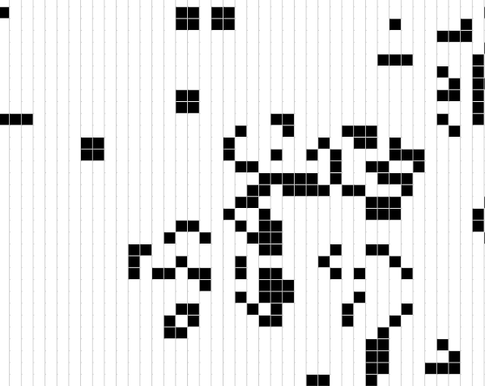

# Rust Wasm Game of Life

[Totally based on the book](https://rustwasm.github.io/book/)



## Required tools

- [Rust toolchain](https://www.rust-lang.org/tools/install)
- [wasm-pack](https://rustwasm.github.io/wasm-pack/installer/)
- [npm](https://www.npmjs.com/get-npm)

## Build project

This will create the wasm code.
Do this every time you change your rust code.

```
wasm-pack build
```


## Install npm

```
cd www
npm install
```

## Link local package to the www project

```
cd pkg
npm link
```

```
cd www
npm link wasm-game-of-life
```

## Run locally

```
cd www
npm start
```

